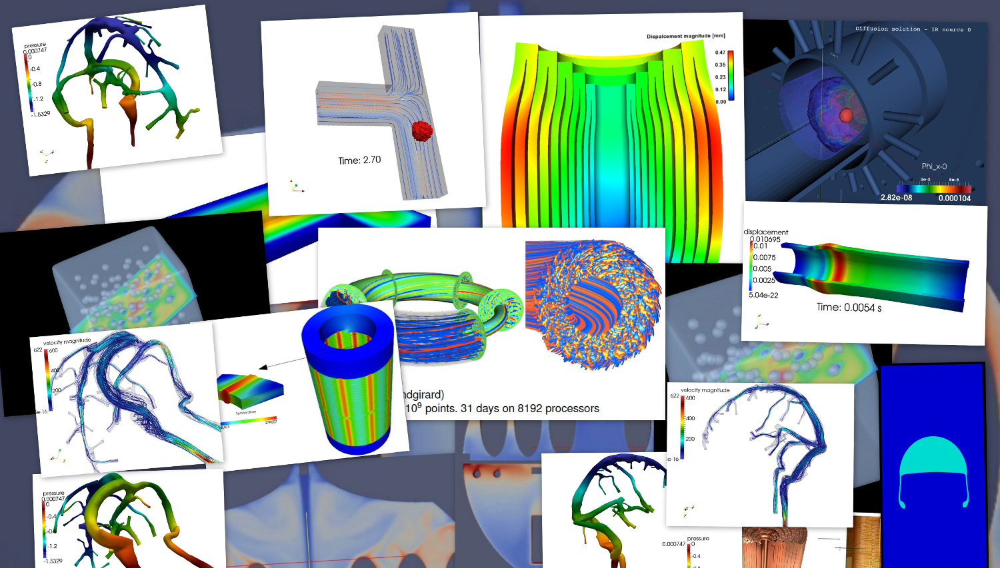

# [fit] 19ème Rencontre Mathématiques Industrie
## Calcul Haute Performance

---
## Programme

 - 13h30 - 14h00 : Accueil / Introduction
 - 14h00 - 15h00 : Atelier 1
 - 15h00 - 15h30 : Pause
 - 15h30 - 16h30 : Atelier 2
 - 16h30 - 17h30 : Table ronde

---
## Accueil - 13h45 - 14h00

Quelques mots d'Introduction

 - Maison de La Simulation
 - [AMIES PDF Slides](RMIHPC2015_AMIES.pdf)
 - SMAI

---

## Atelier 1 - 14h00 - 15h00

##  Calcul sur GPU pour les équations de Maxwell: Histoire d'une collaboration Math Entreprises qui passe à l'échelle

### N. Muot (AxesSim), P. Helluy (U. Strasbourg/CNRS-INSMI) [PDF Slides](RMIHPC2015_PHelluy_NMuot.pdf)

---
## Atelier 2 - 15h30 - 16h30 J. Garnier

## Le HPC au service des Incertitudes

### Analyse de sensibilité globale sur un modèle d’écosystème marin - Déploiement sur grille
#### L Viry (U. Grenoble Alpes) [PDF Slides](RMIHPC2015_LViry.pdf)

### Utilisation des h-matrices pour l’apprentissage et la simulation de champs Gaussiens
#### R. Lebrun (Airbus) [PDF Slides](RMIHPC2015_RLebrun.pdf)

---

## Table Ronde - 16h30 - 17h30

## Quelles collaborations Math Entreprises en HPC: Mathématiques, Acces HPC et Financements ?

### De HPC-PME 1.0 à HPC-PME 2.0: du national au régional
#### S. Requena (GENCI) [PDF Slides](RMIHPC2015_SRequena.pdf)

### Table ronde
#### S. Requena (Genci), P. Helluy (U. Strasbourg, chargé de mission Calcul INSMI), N. Muot (AxesSim) et la salle

---
## Éléments de discussion

 - Collaboration Math Entreprise mode d'emploi
   - Simulation, HPC, quels besoins exactement ?
   - le HPC amène-t'il des problèmes/solutions/questions techniques nouvelles pour les entreprises?
   - quels avantages en tire chaque partie entreprise et académique ?
   - comment intégrer des résultats théoriques ? pereniser les relations ? les diffuser au sein des entreprises ?

---
## Éléments de discussion

 - Collaboration Math Entreprise mode d'emploi
   - Positionnement du docteur dans la collaboration: a t'on besoin d'avoir un docteur ou un doctorant pour ce type de relation ?
   - Accès au HPC par les entreprises:
   - qu'est-ce qui est simple, qu'est-ce qu'il l'est moins?
   - quels financements ? quels types de ressources HPC ?

   # [Compte Rendu de la Rencontre](RMIHPC2015_CompteRendu.md)
